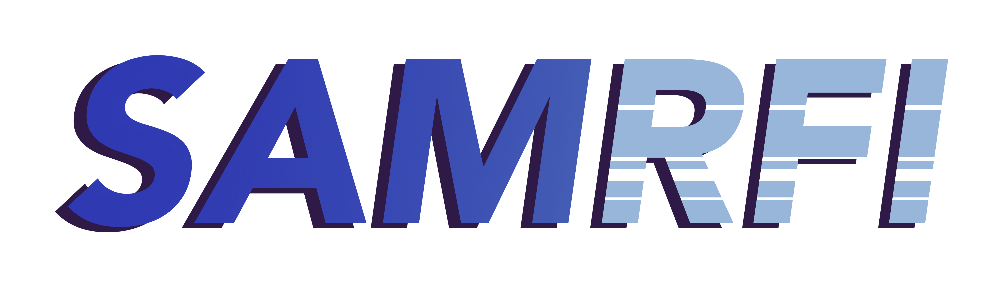

SAM-RFI: Radio Frequency Interference Detection with SAM2
==========================================================

``samrfi`` is a Python package that applies Meta's **Segment Anything Model 2 (SAM2)** to detect and flag Radio Frequency Interference (RFI) in radio astronomy data. Built on HuggingFace transformers, SAM-RFI provides a complete pipeline from synthetic data generation to trained model deployment.

**Key Features:**

- 🚀 **SAM2-based segmentation** - State-of-the-art Hiera transformer architecture
- 📊 **Physically realistic synthetic data** - Generate training data with exact ground truth
- 🔧 **Complete training pipeline** - From MS files to trained models with validation tracking
- ⚡ **GPU-accelerated** - Fast training and inference on CUDA devices
- 🎯 **Iterative flagging** - Multi-pass cleaning for deep RFI removal
- 🛠️ **Command-line interface** - Easy-to-use CLI for all operations

**What's New in v2.0:**

- Migrated to HuggingFace transformers (clean SAM2 API)
- Separated data generation from training (generate once, train many times)
- Added validation loss tracking with dual loss curves
- Implemented iterative N-pass flagging
- GPU profiling and batch size optimization
- Complete CLI with ``samrfi`` command
- 52 unit tests with 96% coverage

This documentation covers installation, quick start guides, and complete API reference for SAM-RFI v2.0.

The project is actively developed on `GitHub <https://github.com/preshanth/SAM-RFI>`_. For bugs or feature requests, please `open an issue <https://github.com/preshanth/SAM-RFI/issues>`_.
   
.. image:: https://img.shields.io/badge/GitHub-preshanth%2FSAM_RFI-blue
   :alt: Static Badge
   :target: https://github.com/preshanth/SAM-RFI

.. image:: http://img.shields.io/badge/license-MIT-blue.svg?style=flat
    :target: https://github.com/preshanth/SAM-RFI/blob/main/LICENSE

.. raw:: html
    

.. toctree::
   :maxdepth: 3
   :hidden:

   Index <self>
   Installation <installation>
   Quickstart <quickstart>
   API <api>

License & Attribution
=====================

Copyright (c) 2024 Derod Deal & Preshanth Jagannathana under the `MIT License <https://github.com/preshanth/SAM-RFI/blob/main/LICENSE>`_.