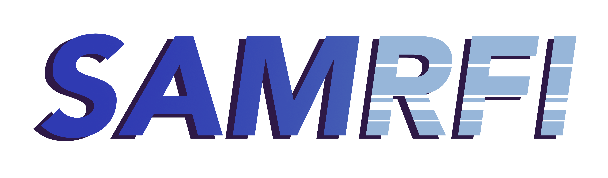

SamRFI
=======

    

``samrfi`` is a package designed to detect and mitigate Radio Frequency Interference (RFI) in radio astronomy data. This pipeline includes tools for
conveniently handling radio data products and provides methods for investigating and mitigating RFI in scientific observations.

This documentation showcases all features, tools, and current applications of `samrfi`. Some applications include visualizing RFI-affected data,
applying various RFI mitigation techniques, and optimizing data quality for scientific analysis.

The pipeline is currently under development on `GitHub <https://github.com/preshanth/SAM-RFI>`_. For any bugs or requests, send us an email or `open an issue on GitHub <https://github.com/YourUsername/SAM-RFI/issues>`_.
   
.. image:: https://img.shields.io/badge/GitHub-preshanth%2FSAM_RFI-blue
   :alt: Static Badge
   :target: https://github.com/preshanth/SAM-RFI

.. image:: http://img.shields.io/badge/license-MIT-blue.svg?style=flat
    :target: https://github.com/preshanth/SAM-RFI/blob/main/LICENSE

.. raw:: html
    

.. toctree::
   :maxdepth: 3
   :hidden:

   Index <self>
   Installation <installation>
   Quickstart <quickstart>
   API <api>

License & Attribution
=====================

Copyright (c) 2024 Derod Deal & Preshanth Jagannathana under the `MIT License <https://github.com/preshanth/SAM-RFI/blob/main/LICENSE>`_.